# Contacts Book

## Description

Simple application for managing person contacts. Users can create contacts with some details, then add addresses to them. One contact can have 0 or multiple addresses.

Note: The purpose of this project is only to demonstrate the used technologies and patterns. Some of the functionalities are not completed, but as a whole the main features are implemented.

## Backend

1. Frameworks and libraries used:

- .NET 7
- ASP Web API
- FluentValidation
- AutoMapper
- MediatR
- EntityFramework
- Swagger Open API

1. Architecture

   Considering the requirements to use FluentValidation, CQRS Pattern and rich domain models, I've used clean architecture with DDD approach.

   

   In this project the above diagram is a bit simplified.
   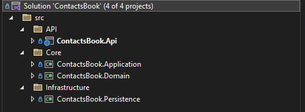

   In the center we have the domain layer `ContactsBook.Domain`. It is independent from the other projects and encapsulates the domain logic.

   The Application layer has access to the domain layer and is responsible for processing the CQRS operations.

   The actual database operations are managed in the infrastructure layer. This layer communicates with the database.

   Here is a high level diagram

   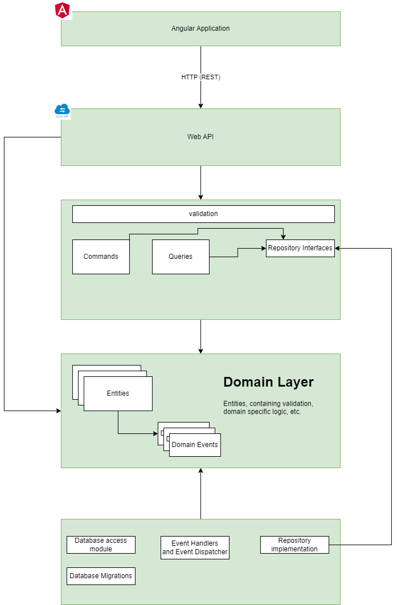

   ## Frontend

   The following frameworks and libraries have been used:

   - Angular 16
   - PrimeNG
   - ngrx

On the home page the list of contacts is shown.

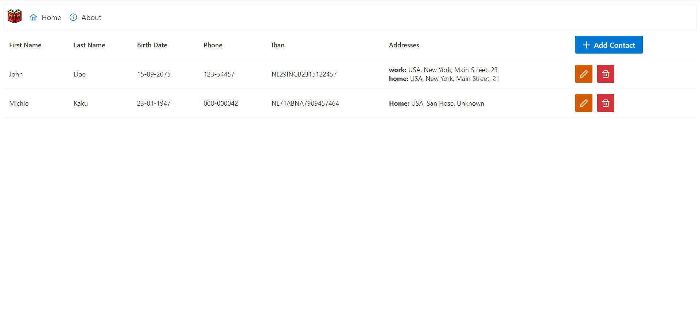

To create new contact click on the `Add Contact` button.
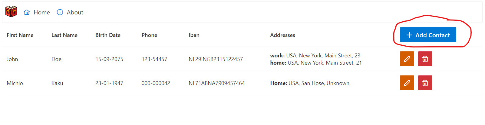

The create contact dialog will be shown

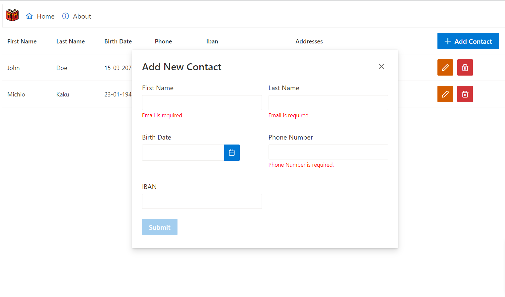

Fill in the form
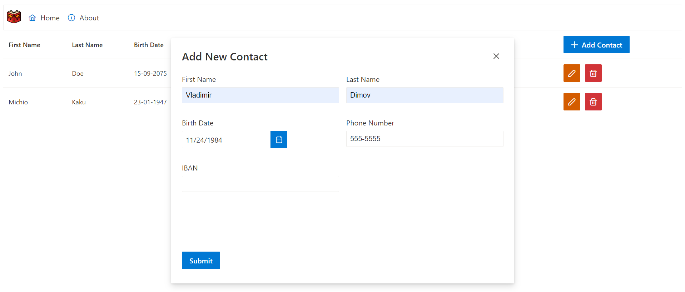

After submit, a success message is shown and the new contact is added to the list of contacts

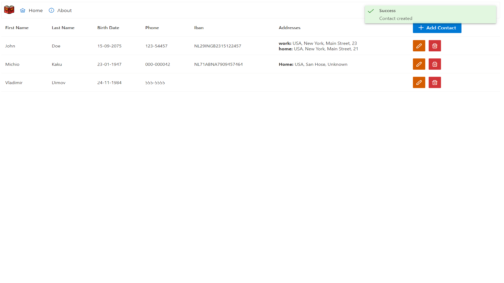

To edit the contact click on the edit button

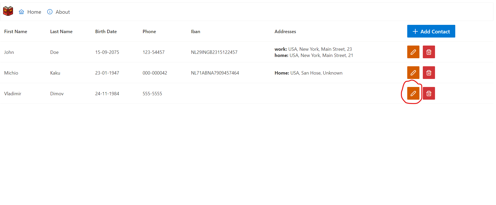

The contact details page will show

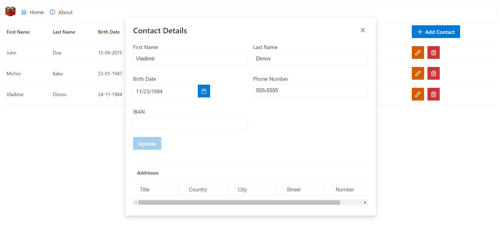

From the details page users can edit the contact or add/remove addresses

To create new address fill in the address form and click the `+` button

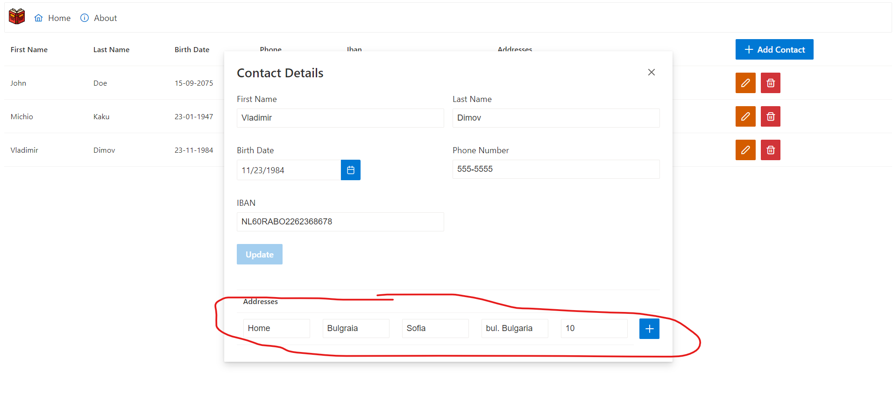

The new address is added to the details page and the contacts list page

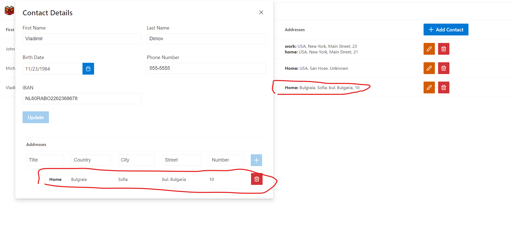

From the details page the address can be deleted.
The address editing is not implemented at this point as it's pretty much the same as the contacts editing.

# E2E tests

Several test scenarios are written in cypress.
There are some simple tests to verify links and pages open.
One test for contact creation which verifies that the contact is created. The created contact is cleaned in the end.

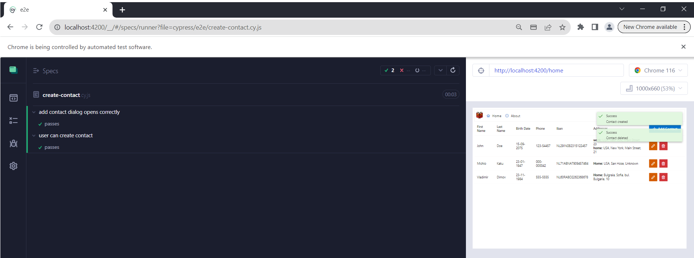
